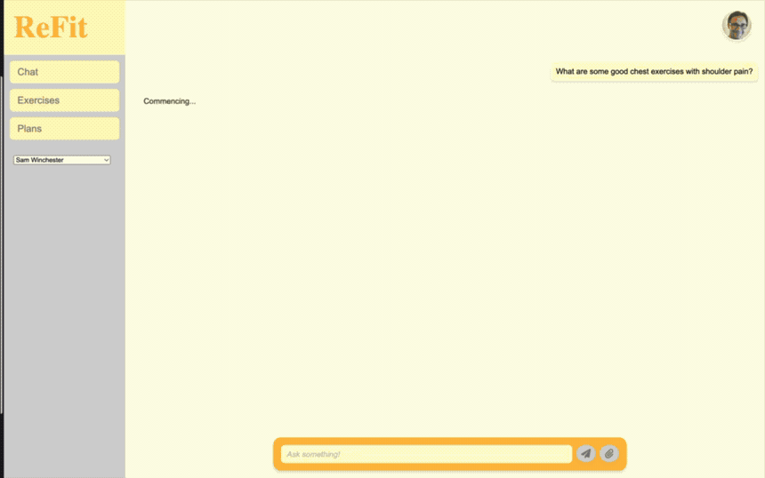
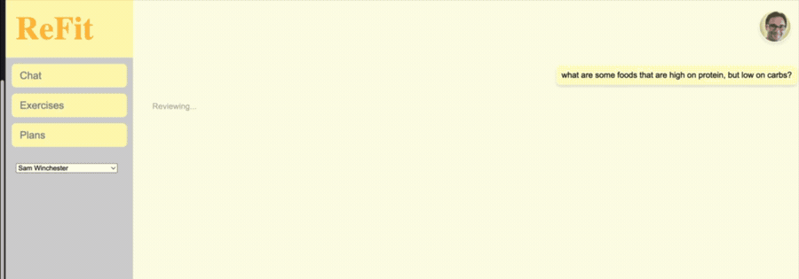
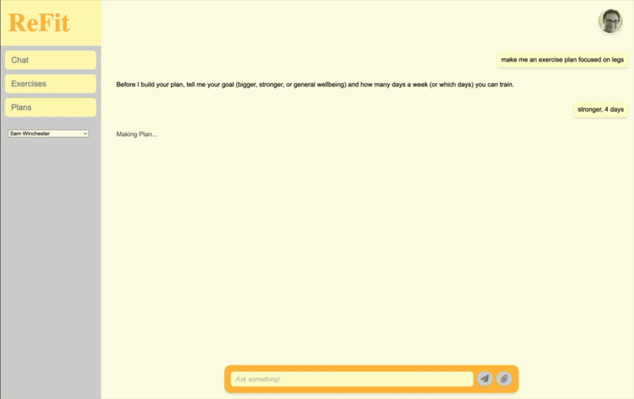
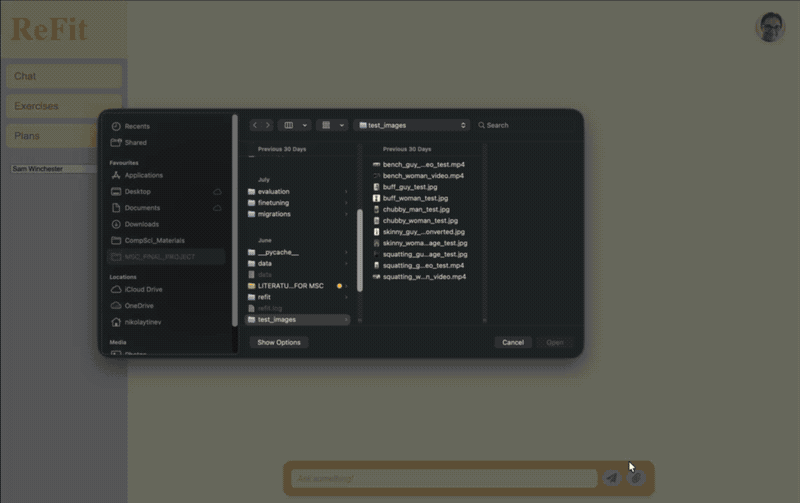

# ReFit

A health assistant that runs entirely on your own machine. All the models
are local, through Ollama, so nothing you type gets sent anywhere.

It answers exercise, injury and nutrition questions, builds and edits weekly workout
plans, and gives feedback on photos and videos of your form. Answers are grounded in a
Postgres database of exercises and UK nutrition data, then checked by a second model
before you see them.

This is not a medical device. Do not take its advice as medical advice.

## What it looks like

**Exercise advice, grounded in the database.** The user states they have shoulder pain, so the retrieval filters out anything the shoulder drives. Every exercise named is one that was
actually retrieved, and clicking it opens the muscle map for that lift.

**Nutrition answers with real numbers.** Macros come from the UK CoFID dataset by vector
search, not from the model's memory.

**Weekly plans.** It asks for the goal and training days first, then emits schema-valid JSON,
which is persisted to Postgres and rendered as an editable week you can tick off.

**Form check from video.** MediaPipe extracts the joint positions, the motion is described in
words, and the model critiques it against the lift.

## How it works

The frontend is React, the backend is FastAPI, and the models run in Ollama. A chat
message goes through several steps rather than one model call:

| Step | Model | What it does |
|---|---|---|
| Classify | llama3.1 | Works out what the user is asking for, one of eight intents |
| Condense | llama3.1 | Rewrites a follow-up into a standalone question |
| Muscles | llama3.1 | Pulls out target and injured muscles to filter the SQL |
| Retrieve | nomic-embed-text | Vector search over the exercise and food tables |
| Answer | llama3.1 | A DPO fine-tune of Llama 3.1, tuned to know when to refer on |
| Review | qwen2.5:7b | Checks the draft for unsafe or unsupported claims |
| Rewrite | llama3.1 | Turns the reviewed answer into the final reply |

Photos and videos go to qwen2.5vl, with MediaPipe pulling the joint positions out of
video frames first. The steps that need structured output use Ollama's JSON schema
mode rather than parsing text.

## What you need

- 16 GB of RAM, ideally more. Several 7B models get loaded.
- About 30 GB of disk for the weights.
- Python 3.11+, Node 20+, PostgreSQL with pgvector, and Ollama.

It works without a GPU but it is slow, since one message is five or more model calls.

## Setup

**Models.** 

    ollama pull llama3.1
    ollama pull qwen2.5:7b
    ollama pull qwen2.5vl:7b
    ollama pull nomic-embed-text

**Database.**

    createdb exercise_database
    psql -d exercise_database -f db/schema.sql
    psql -d exercise_database -f db/seed_users.sql
    python data/import_data.py
    python data/generate_embeddings.py

That covers exercises. The nutrition tables stay empty unless you also load CoFID,
which is not redistributed here — download the spreadsheet from
[GOV.UK](https://www.gov.uk/government/publications/composition-of-foods-integrated-dataset-cofid),
then:

    COFID_XLSX=/path/to/cofid.xlsx python data/import_foods.py
    python data/import_nutrient_reference.py
    python data/generate_food_embeddings.py

Without this the exercise side works normally and nutrition questions return nothing.

On Windows, Postgres wants a password, and the connection code only passes a database
name and a user. Set `PGPASSWORD` and `REFIT_DB_USER` in your environment before
starting the backend and it will pick them up.

**The rest.**

    pip install -r requirements.txt
    cd refit && npm install

## Running it

Backend, from the project root:

    uvicorn main:app --reload --port 8000

Frontend:

    cd refit && npm run dev

Then go to http://localhost:5173. Both ports are hardcoded, in the fetch calls and in
the CORS list in main.py, so they have to be those two.

Try asking for an exercise for a muscle, mentioning an injury and seeing it get
excluded, or asking for a weekly plan and then opening the Plans tab. Typing `/clear`
resets the conversation.

## Evaluation

Everything is in `evaluation/`. The results are already committed, so the numbers in
the dissertation can be checked without running anything:

    python evaluation/aggregate.py

Regenerating them needs the models and a paid API key in `LLM_API_KEY` for the judge.
`run_ladder.py` also needs `run_chat_pipeline` to take an `arm` argument, which is
instrumentation for the ablation and is not in the shipped pipeline.

## Where things are

    main.py                  the API endpoints
    pipelines/               the chat, video, nutrition and plan pipelines
    classification.py        intent and muscle classifiers
    retrieval.py             reads from Postgres
    user_data.py             writes to Postgres
    llm.py                   the Ollama JSON wrapper
    prompts_and_schemas.py   every prompt and schema
    vision.py                photos and videos
    memory.py                conversation state
    db/                      schema and seed data
    data/                    source CSVs and the import scripts
    frontend/                the React frontend

## Credit

The exercise body was originally built from the
[ExRx.net Exercise Directory](https://exrx.net/Lists/Directory), whose content is
copyright ExRx.net, LLC. The descriptions in this repository have been rewritten and
are not ExRx text; Exercise names, equipment, difficulty and the muscle mappings
are my own.

The muscle diagram is from
[Muscles front and back](https://commons.wikimedia.org/wiki/File:Muscles_front_and_back.svg)
by OpenStax, redrawn by Tomáš Kebert and umimeto.org, under
[CC BY-SA 4.0](https://creativecommons.org/licenses/by-sa/4.0/). I labelled the muscle
paths so they could be coloured per exercise. That change is under the same licence.

Nutrition data is CoFID 2021 from Public Health England, under the Open Government
Licence v3.0, with dietary reference values from their Government Dietary
Recommendations (2016).

